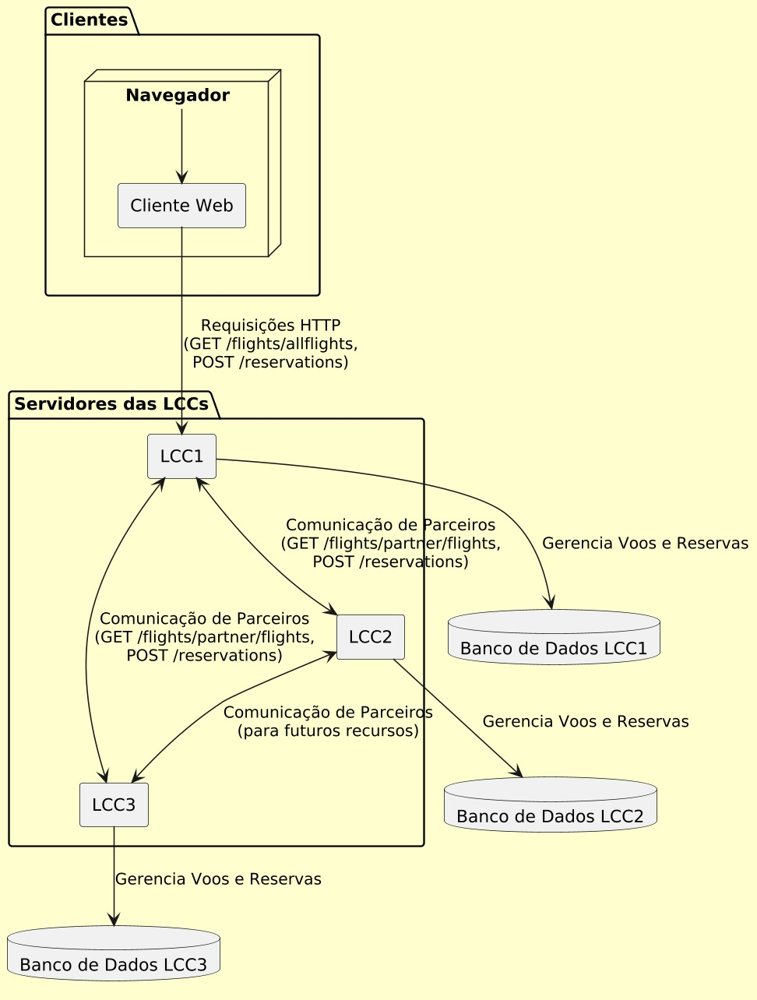
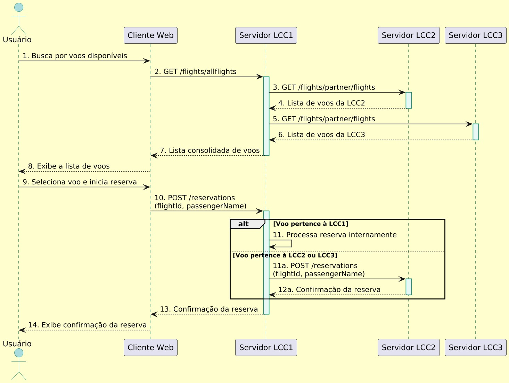

# Sistema de Reserva de Passagens Aéreas entre LCCs Brasileiras

Este projeto propõe uma solução distribuída para integração de companhias aéreas de baixo custo (LCCs) no Brasil, permitindo a oferta colaborativa de voos e ampliando a disponibilidade de passagens para os passageiros.

## Introdução

Para maximizar o lucro e otimizar o uso dos assentos, três companhias aéreas de baixo custo (LCCs) brasileiras decidiram compartilhar trechos de voos, permitindo que clientes reservem passagens em uma única compra. Cada companhia possui seu próprio servidor centralizado do sistema VENDEPASS, mas desenvolvemos uma API RESTful que conecta esses servidores, facilitando o acesso às rotas e assentos disponíveis. Essa arquitetura distribuída e descentralizada elimina a necessidade de um servidor central e permite a expansão futura para outras LCCs. Com contêineres Docker, garantimos escalabilidade e portabilidade, enquanto um sistema de reserva sincronizado assegura a prioridade dos assentos na primeira compra. O resultado é uma plataforma integrada que amplia as opções de rotas e melhora a experiência do usuário.

## Arquitetura

A arquitetura do sistema é distribuída e descentralizada, com cada LCC operando seu próprio servidor que utiliza APIs RESTful para comunicação direta entre si. A interface para os usuários finais é uma aplicação web desenvolvida em React com Material-UI, garantindo uma experiência de usuário otimizada.

   
*Figura 1*: Diagrama da arquitetura do sistema, ilustrando a interação entre clientes e servidores das LCCs.

## Desenvolvimento dos Componentes

### Servidores das LCCs
- **Tecnologia**: Node.js com Express.js
- **Funcionalidades**:
  - Gerenciamento de voos e reservas
  - Comunicação com parceiros
  - APIs protegidas por autenticação via chave de API

### Cliente Web
- **Tecnologia**: React com Material-UI
- **Funcionalidades**:
  - Pesquisa e reserva de voos
  - Consumo das APIs das LCCs

### Containerização
- **Ferramentas**: Docker e Docker Compose
- **Objetivo**: Garantir portabilidade e facilitar a implantação dos serviços

## Comunicação entre os Componentes

### APIs RESTful

Endpoints principais:
- **Entre LCCs**:
  - `GET /flights/partner/flights`: Compartilhamento de voos entre parceiros
  - `POST /reservations`: Criação de reservas
- **Entre Cliente e Servidor**:
  - `GET /flights/allflights`: Listagem consolidada de voos
  - `POST /reservations`: Reserva de voos

### Segurança
- Autenticação via chave de API para parceiros
- Middleware de autenticação nos servidores

## Gerenciamento de Rotas e Reservas

### Agregação de Voos
- Os voos dos parceiros são integrados, exibindo uma lista unificada para o usuário final.

### Controle de Concorrência
- Implementado um controle de disponibilidade antes de confirmar a reserva.

## Ferramentas e Tecnologias

- **Backend**: Node.js, Express.js, Axios
- **Frontend**: React.js, Material-UI, Axios
- **Containerização**: Docker, Docker Compose
- **Controle de Versão**: Git e GitHub

## Testes Realizados

- **Funcionais**: Testes de reserva em voos próprios e de parceiros.
- **Desconexão de Servidores**: Verificação da continuidade do serviço em caso de falhas.
- **Concorrência**: Testes para garantir integridade das reservas.

## Avaliação da Solução

- **Vantagens**:
  - Arquitetura descentralizada
  - Escalabilidade e portabilidade via Docker
- **Limitações**:
  - Controle de concorrência a ser melhorado
  - Falta de roteamento complexo
- **Desempenho**: Resultados satisfatórios em testes locais

  
*Figura 2*: Fluxo de interação durante o processo de reserva.

## Conclusão

A solução desenvolvida permite a colaboração entre LCCs brasileiras, ampliando a oferta de voos sem necessidade de centralização. É uma base sólida para futuras melhorias, como mecanismos mais robustos de sincronização e algoritmos de roteamento avançado.

## Referências

1. [Material-UI](https://mui.com/pt/)
2. [Docker Documentation](https://docs.docker.com/)
3. [Node.js Documentation](https://nodejs.org/en/docs/)
4. [React Documentation](https://reactjs.org/docs/getting-started.html)
5. Fielding, R. T. (2000). *Architectural Styles and the Design of Network-based Software Architectures*

---

# Passo a Passo para Executar o Sistema de Reserva de Passagens Aéreas entre LCCs Brasileiras

Para iniciar o sistema, certifique-se de que todos os pré-requisitos estão atendidos e siga as instruções abaixo.

## Pré-Requisitos

- **Docker** e **Docker Compose** instalados.
- Verifique as versões com os seguintes comandos:
  ```bash
  docker --version
  docker-compose --version

Docker Desktop deve estar aberto.

## 1. Configuração e Execução dos Contêineres

No diretório onde o arquivo `docker-compose.yml` está localizado, execute o seguinte comando no terminal ou PowerShell:

- ```bash
  docker-compose up --build

Este comando fará o seguinte:

- Constrói as imagens Docker para os serviços `lcc1`, `lcc2`, `lcc3` e `client`.
- Inicia os contêineres com base nas imagens criadas, conectando-os na rede `lcc-network`.

## 2. Verificar o Status

Após a execução do comando, o Docker Compose exibirá logs indicando que os contêineres foram iniciados. Você verá mensagens de log para cada serviço, como `lcc1`, `lcc2`, `lcc3` e `client`.

## 3. Acessar o Cliente Web

Após a inicialização bem-sucedida dos contêineres, abra um navegador e acesse o cliente web:

- **URL:** [http://localhost](http://localhost)

Isso abrirá a interface de pesquisa e reserva de voos.

## 4. Interagir com a Aplicação

No cliente web, você poderá:

- **Pesquisar Voos:** O sistema exibirá uma lista de voos agregados das companhias parceiras.
- **Reservar Passagens:** O cliente permite fazer reservas, acionando as APIs das companhias aéreas LCC.

## 5. Verificar Logs e Status dos Contêineres

Para acompanhar a execução e verificar possíveis erros:

- **Logs dos Contêineres:**
  ```bash
  docker-compose logs

- **Status dos Contêineres:**
  ```bash
  docker-compose ps

## 6. Parar e Limpar os Contêineres
- Após o uso, para interromper e remover os contêineres, execute:
  ```bash
  docker-compose down